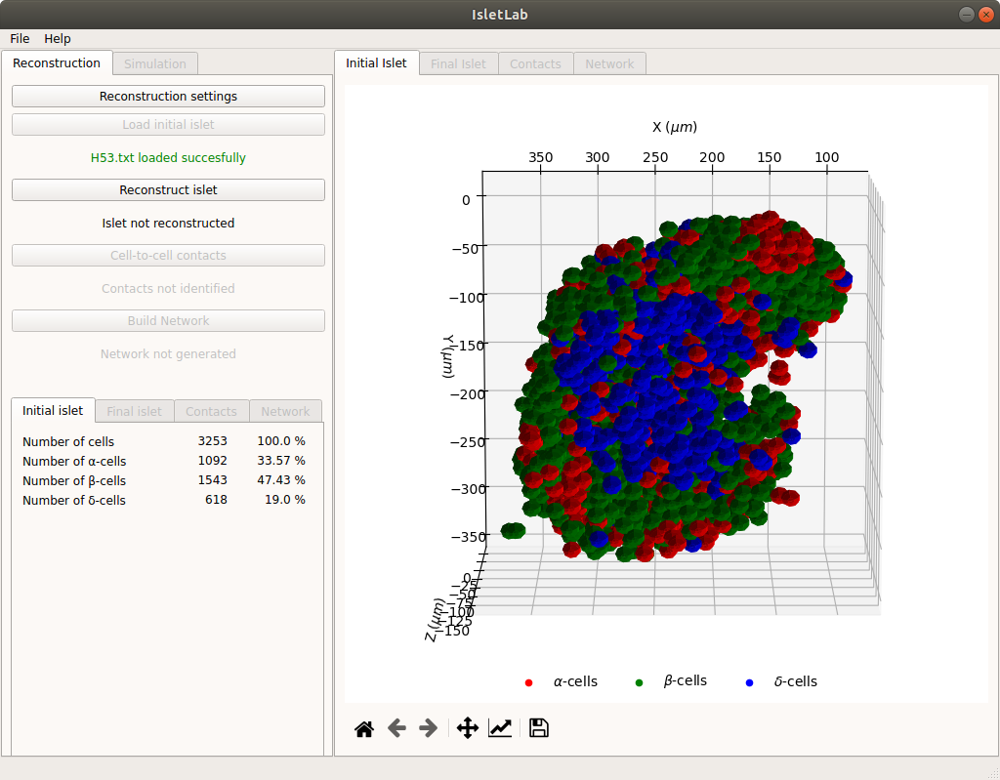

 ```
  ___     _      _   _          _        _   _  
 |_ _|___| | ___| |_| |    __ _| |__    (_)_(_) 
  | |/ __| |/ _ \ __| |   / _` | '_ \  (_) _ (_)
  | |\__ \ |  __/ |_| |__| (_| | |_) |  | (_) | 
 |___|___/_|\___|\__|_____\__,_|_.__/  (_)___(_)
                                        (_) (_)  v1.0
 ```



### Isletlab Project

This software is lecensed under the GPL V3 Open Source Licence

Project created by:

**Gerardo J. Félix-Martínez**
Consejo Nacional de Ciencia y Tecnología (México)
Universidad Autónoma Metropolitana, Iztapalapa.

[Google Scholar](https://scholar.google.com/citations?user=wcuaM4QAAAAJ&hl=en&authuser=1) 

Website:<https://gjfelix.github.io>

Email: gjfelix2005@gmail.com


September 2021

====================================================================

Current version of Isletlab has been fully tested in Ubuntu Linux 18.

**Requirements:**

- [ ] [Anaconda](https://anaconda.org/) (Python 3.8) 
- [ ] GCC compiler
- [ ] NVCC compiler ([CUDA toolkit](https://developer.nvidia.com/cuda-toolkit))
- [ ] [CUDA capable NVIDIA GPU Device](https://developer.nvidia.com/cuda-gpus)

**Installation**

1. Clone the Isletlab repository (this page). If you downloaded the repository as a zip file, extract the files.

2. Open the terminal and go to the repository folder.

3. Create a conda environment using the **isletlabgui_v1.0.yml** file. All the python modules needed will be installed automatically.

   ```
   conda env create -f isletlabgui_v1.0.yml
   ```

4. Activate the new environment

   ```
   source activate isletlab_v1.0
   ```

5. Run Isletlab:

   ```
   python isletlabgui_v1.0.py
   ```

Currently I'm working on the detailed documentation. Please, if you are unable to run Isletlab do not hesitate to send me an email (<gjfelix2005@gmail.com>). 

In case you find a bug or want to contribute with an idea or request, please [create an issue](https://github.com/gjfelix/IsletLab/issues).

